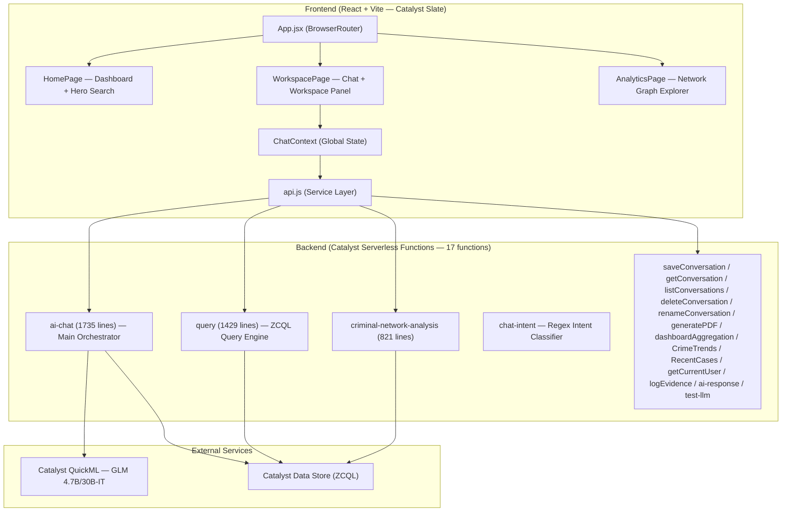
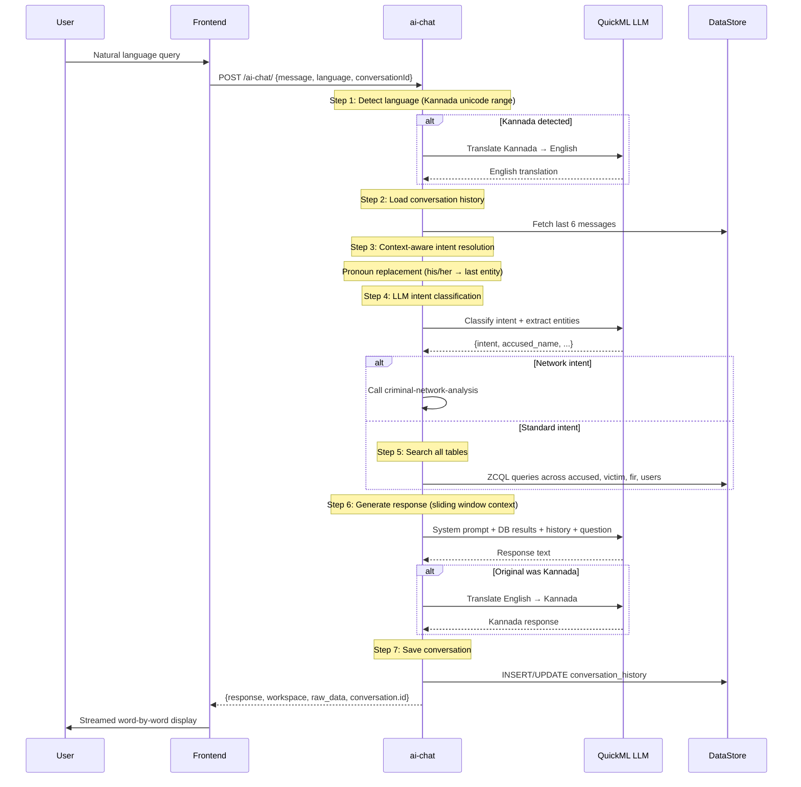

# 🔍 KSP Crime Intelligence Platform — Full Project Analysis

## Project Overview

**Project Name:** Lumina Intelligence — KSP Crime Intelligence Platform  
**Deployed As:** `Techsonic-Crime-Intelligence` on Zoho Catalyst  
**Project ID:** `47024000000013051` | **Org ID:** `60073436832`

A conversational AI platform for Karnataka State Police enabling investigators to query crime data using natural language, visualize criminal networks, and gain predictive insights.

---

## Architecture Summary

---

## Tech Stack

| Layer | Technology | Version |
|-------|-----------|---------|
| Frontend Framework | React | 19.2.7 |
| Build Tool | Vite | 5.3.1 |
| Styling | TailwindCSS | 3.4.19 |
| Animations | Framer Motion | 12.42.0 |
| Icons | Lucide React | 1.21.0 |
| Charts | Recharts | 3.9.0 |
| Routing | React Router DOM | 7.18.0 |
| Backend Runtime | Zoho Catalyst Serverless (Node.js) | — |
| Database | Zoho Catalyst Data Store (ZCQL) | — |
| LLM | GLM 4.7B/30B-IT (`crm-di-glm47b_30b_it`) via Catalyst QuickML | — |
| PDF Generation | PDFKit | — |
| Hosting | Catalyst Slate (frontend) + Catalyst Functions (backend) | — |

---

## Frontend Structure (55+ components)

### Pages (3)
| Page | Route | Purpose |
|------|-------|---------|
| [HomePage.jsx](file:///d:/Project/KSP/KSP_catalyst/react-vite/src/pages/HomePage.jsx) | `/` | Dashboard with hero search, suggested queries, crime trends, heatmap, alerts, network preview |
| [WorkspacePage.jsx](file:///d:/Project/KSP/KSP_catalyst/react-vite/src/pages/WorkspacePage.jsx) | `/chat/:id` | Split-pane: Chat window (left) + Workspace visualizations (right, 380px) |
| [AnalyticsPage.jsx](file:///d:/Project/KSP/KSP_catalyst/react-vite/src/pages/AnalyticsPage.jsx) | `/analytics` | Network graph explorer with 4 tabs: Graph, Metrics, Path, Communities |

### State Management
| Context | File | Responsibility |
|---------|------|---------------|
| ChatContext | [ChatContext.jsx](file:///d:/Project/KSP/KSP_catalyst/react-vite/src/context/ChatContext.jsx) (733 lines) | Conversations CRUD, message send/stream, workspace, PDF export, abort control |
| ThemeContext | [ThemeContext.jsx](file:///d:/Project/KSP/KSP_catalyst/react-vite/src/contexts/ThemeContext.jsx) | Dark/light mode toggle |
| LanguageContext | [LanguageContext.jsx](file:///d:/Project/KSP/KSP_catalyst/react-vite/src/contexts/LanguageContext.jsx) | English/Kannada i18n |
| SidebarContext | [SidebarContext.jsx](file:///d:/Project/KSP/KSP_catalyst/react-vite/src/contexts/SidebarContext.jsx) | Sidebar collapse/expand |

### Workspace Visualization Registry (11 types)
| Key | Component | Purpose |
|-----|-----------|---------|
| `heatmap` | HeatMap | Crime geographic heat visualization |
| `network` | CriminalNetwork → NetworkGraph | Interactive criminal network graph (canvas-based, 580 lines) |
| `network_metrics` | NetworkMetrics | Network statistics dashboard |
| `network_path` | ShortestPath | Find shortest path between two people |
| `network_community` | CommunityView | Community detection visualization |
| `timeline` | Timeline | Event timeline view |
| `chart` | AnalyticsChart | Generic analytics charts (Recharts) |
| `profile` | OffenderProfile | Criminal profile card |
| `financial` | FinancialAnalysis | Financial crime analysis |
| `trend` | CrimeTrend | Crime trend line charts |
| `alert` | RecentAlerts | Alert cards |

### i18n Support
- **English**: [en.json](file:///d:/Project/KSP/KSP_catalyst/react-vite/src/i18n/en.json) (9.7 KB)
- **Kannada**: [kn.json](file:///d:/Project/KSP/KSP_catalyst/react-vite/src/i18n/kn.json) (17 KB)

---

## Backend Functions (17 registered)

### Core Functions
| Function | Size | Purpose |
|----------|------|---------|
| [ai-chat](file:///d:/Project/KSP/KSP_catalyst/functions/ai-chat/index.js) | **70KB, 1735 lines** | **Main orchestrator** — Language detection → translation → context resolution → LLM intent classification → DB search → LLM response generation → translation back → save conversation |
| [query](file:///d:/Project/KSP/KSP_catalyst/functions/query/index.js) | **44KB, 1429 lines** | Core ZCQL query engine with 20+ intents, entity extraction, and validation |
| [criminal-network-analysis](file:///d:/Project/KSP/KSP_catalyst/functions/criminal-network-analysis/index.js) | **28KB, 821 lines** | Full network graph builder, metrics, shortest path, community detection |
| [chat-intent](file:///d:/Project/KSP/KSP_catalyst/functions/chat-intent/index.js) | **2.5KB, 121 lines** | Simple regex-based intent classifier (fallback) |

### Supporting Functions
| Function | Purpose |
|----------|---------|
| saveConversation | Persist chat to Catalyst Data Store |
| getConversation | Fetch conversation by ID |
| listConversations | List all user conversations |
| deleteConversation | Delete conversation |
| renameConversation | Rename conversation title |
| generatePDF | Export conversation as PDF (PDFKit) |
| dashboardAggregation | Dashboard metrics aggregation |
| CrimeTrends | Crime trend data (time-series) |
| RecentCases | Recent FIR cases feed |
| getCurrentUser | Get logged-in user info |
| logEvidence | Log AI evidence artifacts |
| ai-response | Alternative AI response handler |
| test-llm | LLM connectivity test |

---

## AI/LLM Pipeline (ai-chat function)

---

## Database Schema (inferred from ZCQL queries)

| Table | Key Columns |
|-------|-------------|
| `accused` | ROWID, full_name, gender, occupation, address, risk_score, is_repeat_offender |
| `victim` | ROWID, full_name, gender, occupation, address, phone_number |
| `fir` | ROWID, fir_number, status, date_registered, investigating_officer, description, crime_type_rowid, location_rowid, priorites |
| `fir_accused` | fir_rowid, accused_rowid, role_in_crime |
| `fir_victim` | fir_rowid, victim_rowid |
| `crime_type_master` | ROWID, crime_name, parent_category |
| `location` | ROWID, city, district, latitude, longitude |
| `conversation_history` | ROWID, user_rowid, conversation_title, conversation (JSON), question, response, language, created_at |
| `users` | ROWID, full_name, email, phone_number |

---

## Supported Query Intents (20+)

| Category | Intents |
|----------|---------|
| **Search** | `search_fir`, `search_accused`, `search_victim`, `search_investigation` |
| **FIR Details** | `fir_accused`, `fir_victims`, `fir_investigation` |
| **Criminal Analysis** | `criminal_history`, `criminal_network`, `criminal_network_graph`, `repeat_offenders`, `risk_profile` |
| **Location/Trends** | `crime_hotspots`, `crime_type_trends`, `monthly_crime_trends`, `district_crime_analysis`, `emerging_crime_clusters` |
| **Demographics** | `gender_crime_analysis`, `demographic_dashboard`, `repeat_offender_demographics` |
| **Social** | `social_risk_analysis` |
| **Network** | `network_analysis`, `network_metrics`, `network_path`, `network_community` |

---

## Challenge Requirement Coverage Matrix

| # | Requirement | Status | Implementation |
|---|-------------|--------|---------------|
| 1 | Natural language chatbot (English + Kannada) | ✅ **Done** | ai-chat with LLM intent classification + Kannada translate |
| 2 | Voice-enabled interaction | ⚠️ **Partial** | VoiceButton exists but `onClick` handler is a no-op (no STT/TTS) |
| 3 | Context-aware conversations | ✅ **Done** | Pronoun resolution + sliding window context manager |
| 4 | PDF export of conversation history | ✅ **Done** | generatePDF function + frontend download flow |
| 5 | Criminal network visualization | ✅ **Done** | Canvas-based interactive network graph (580 lines) |
| 6 | Crime trend & hotspot detection | ✅ **Done** | CrimeTrends dashboard, HeatMap, LiveHotspots |
| 7 | Predictive analytics & early warnings | ⚠️ **Partial** | PriorityAlerts component exists but no ML model backing |
| 8 | Explainable AI with audit trails | ⚠️ **Partial** | logEvidence function exists; no visual evidence trail in UI |
| 9 | Role-based secure access | ⚠️ **Partial** | Catalyst Authentication available but no RBAC logic in code |
| 10 | Criminal network analysis | ✅ **Done** | Full graph, metrics, shortest path, community detection |
| 11 | Socio-demographic insights | ✅ **Done** | gender_crime_analysis, demographic_dashboard, social_risk_analysis intents |
| 12 | Behavioural profiling | ✅ **Done** | risk_profile intent, OffenderProfile component |
| 13 | Crime forecasting | ⚠️ **Partial** | emerging_crime_clusters exists but no actual ML prediction |
| 14 | Financial crime analysis | ⚠️ **Partial** | FinancialAnalysis viz component but no dedicated backend |
| 15 | Investigator decision support | ⚠️ **Partial** | Case summaries exist but no "similar cases" recommendation engine |

---

## Key Findings & Observations

### ✅ Strengths
1. **Solid architecture** — Clean separation: serverless backend, React SPA, well-organized component hierarchy
2. **Rich LLM pipeline** — Multi-step: detect → translate → classify → query → generate → translate-back
3. **Context management** — Sliding window with token counting and message prioritization
4. **Network graph** — Full canvas-based interactive graph with zoom, pan, drag, filters, search
5. **Bilingual support** — Complete i18n (en + kn) with runtime switching
6. **Conversation persistence** — Full CRUD with backend sync and optimistic updates
7. **Robust error handling** — Corrupted JSON recovery, retry logic on translation, fallback responses
8. **Mock mode** — Toggle `USE_MOCK` for full frontend development without backend

### ⚠️ Gaps / Areas for Improvement

1. **Voice interaction is a stub** — `VoiceButton` renders a mic icon but has no `onClick` handler. No Web Speech API, no Catalyst Zia STT/TTS integration.

2. **No actual authentication/RBAC** — The `getCurrentUser` function exists, and Catalyst Authentication is available, but there's no login flow, route guards, or role-based access control in the frontend.

3. **Hardcoded credentials in source** — [test-model.js](file:///d:/Project/KSP/KSP_catalyst/test-model.js) contains an OAuth access token in plain text (line 9). The [.env](file:///d:/Project/KSP/KSP_catalyst/functions/ai-chat/.env) file holds tokens but is committed to the repo.

4. **SQL injection risk** — The `safeString()` function only escapes single quotes (`'` → `''`). ZCQL queries use string interpolation throughout (e.g., `WHERE full_name = '${safeString(variation)}'`). While Catalyst Data Store may have built-in protections, this pattern is fragile.

5. **No streaming from LLM** — The backend receives the full response (`stream: false`) and the frontend simulates word-by-word streaming with `setTimeout(30ms)`. Not true server-sent events.

6. **Monolithic backend files** — `ai-chat/index.js` is 1735 lines and `query/index.js` is 1429 lines. These should be modularized.

7. **Dual conversation save** — Both `ai-chat` (backend-side `saveConversationDirect`) and `ChatContext` (frontend-side `saveConversationToBackend`) save conversations, potentially causing data conflicts.

8. **Analytics page uses mock data only** — `AnalyticsPage.jsx` imports `mockCriminalNetworkData` directly and doesn't fetch real data from the backend.

9. **No Catalyst services used for voice** — The challenge requires Catalyst Zia Services for STT/TTS, but none are integrated.

10. **Reports page is a placeholder** — `/reports` and `/settings` routes render "Coming Soon" placeholders.

11. **No audit log UI** — `logEvidence` function exists but there's no frontend to browse or display evidence/audit trails.

12. **Financial analysis has no backend** — `FinancialAnalysis.jsx` visualization component exists but there are no financial-related query intents or database tables.

---

## File Metrics

| Area | Files | Total Size |
|------|-------|------------|
| Backend (functions/) | 17 functions, ~20 source files | ~150 KB source |
| Frontend (react-vite/src/) | ~55 component files | ~200 KB source |
| i18n translations | 2 language files | ~27 KB |
| Mock data | 2 files | ~20 KB |
| Largest files | ai-chat (70KB), query (44KB), criminal-network-analysis (28KB), NetworkGraph (23KB), ChatContext (22KB) | — |

---

## Catalyst Services Usage

| # | Required Service | Used? | Notes |
|---|-----------------|-------|-------|
| 1 | Serverless Functions | ✅ | 17 functions registered |
| 4 | Slate (Frontend) | ✅ | react-vite deployed via Catalyst Slate |
| 6 | Data Store (ZCQL) | ✅ | Primary database |
| 11 | QuickML (LLM) | ✅ | GLM 4.7B/30B-IT for intent + response + translation |
| 14 | Zia Services (OCR/etc.) | ❌ | Not used |
| 15 | Zia Services (Voice) | ❌ | **Not used — STT/TTS missing** |
| 16 | SmartBrowz (PDF) | ❌ | Using PDFKit instead (may affect evaluation) |
| 17 | Authentication | ❌ | Not implemented |
| 18 | API Gateway | ❌ | Not configured |
