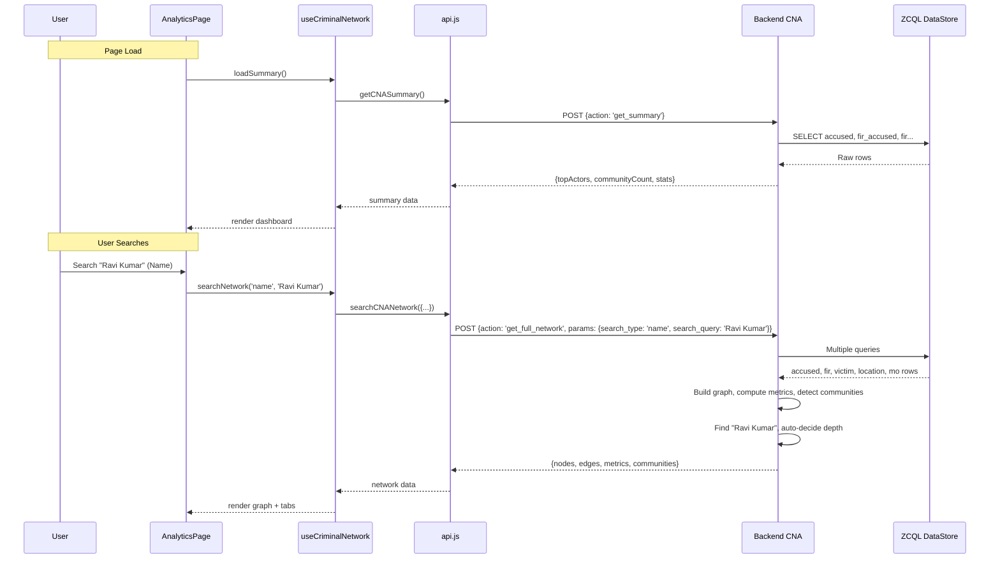

# Criminal Network Analysis (CNA) — Dynamic Data Integration

Replace hardcoded mock data with live Zoho Catalyst Data Store data for the CNA feature at `/analytics` and the homepage network preview.

---

## Design Decisions (Confirmed via Interview)

| # | Decision | Choice |
|---|----------|--------|
| 1 | Search scope | Auto-adaptive: focused graph (2-hop) for >10 connections, full network for smaller |
| 2 | Search input | Single search bar with dropdown: Name / FIR Number / Location |
| 3 | Backend approach | Fix existing `criminal-network-analysis` backend (ZCQL row access bug) |
| 4 | Initial page state | Summary dashboard on load (top 10 actors, communities, stats), graph after search |
| 5 | Autocomplete | No — simple text input with search button |
| 6 | Page layout | Keep 3-tab layout: Graph, Metrics, Communities (remove Shortest Path) |
| 7 | Homepage preview | Replace with dynamic data from same backend |
| 8 | Error handling | Loading spinner + skeleton UI, error with retry button |
| 9 | Node click behavior | Expandable detail panel showing entity info (accused details, linked FIRs, risk profile) |
| 10 | Graph depth | Backend auto-decides: 2-hop if >10 connections, 3-hop if ≤10 |
| 11 | FIR search | FIR as center node with all connected entities radiating outward |

---

## Proposed Changes

### Backend — Criminal Network Analysis Function

#### [MODIFY] [index.js](file:///d:/Project/KSP/KSP_catalyst/functions/criminal-network-analysis/index.js)

**Bug Fix** (Critical — line 149): The ZCQL JOIN response returns rows where column names are prefixed with the table name but the current code accesses `row.fir`, `row.accused`, etc. For JOIN queries like `SELECT f.ROWID, f.fir_number... FROM fir f LEFT JOIN location l...`, ZCQL returns flat objects like `{ fir: { ROWID: ..., fir_number: ... }, location: { city: ... } }`. The error occurs because the response structure from ZCQL varies — for simple queries it's `row.tablename.column` but the code assumes a consistent structure.

Changes:
1. **Fix ZCQL row destructuring** across all query handlers:
   - Add safe row access helper: `getRow(row, tableName)` that checks `row[tableName]` and falls back to `row`
   - Fix `accusedRows` → `row.accused` (verify this works, likely correct for simple SELECT)
   - Fix `firRows` → the JOIN query returns `row.fir` for fir columns and `row.location` for location columns — need to handle the flat/nested response
   - Fix `victimRows`, `moRows`, `firAccusedRows`, `firVictimRows`, `firMORows`

2. **Add search parameter support** for new search types:
   - `params.search_type`: `'name'` | `'fir_number'` | `'location'`
   - `params.search_query`: the search string
   - When `search_type === 'name'` → find accused/victim by name, set as center, BFS expand
   - When `search_type === 'fir_number'` → find FIR by number, set as center node, show all connected entities
   - When `search_type === 'location'` → filter to FIRs in that location

3. **Add auto-adaptive depth**:
   - After finding the center node, count its direct edges
   - If direct edges > 10 → use depth=2, else use depth=3
   - Override with `params.depth` if explicitly provided

4. **Add `get_summary` action** for the initial dashboard view:
   - Returns: top 10 key actors, community count, total nodes/edges, density, dominant crime types
   - Does NOT return full node/edge lists (lightweight)

---

### Frontend — API Service Layer

#### [MODIFY] [api.js](file:///d:/Project/KSP/KSP_catalyst/react-vite/src/services/api.js)

Add new API methods:
```javascript
// Fetch CNA summary for dashboard (initial page load)
getCNASummary() {
  return request('/criminal-network-analysis', { action: 'get_summary' })
}

// Search CNA by name, FIR number, or location
searchCNANetwork({ searchType, searchQuery, depth }) {
  return request('/criminal-network-analysis', {
    action: 'get_full_network',
    params: { search_type: searchType, search_query: searchQuery, depth }
  })
}

// Get full network (for homepage preview)
getCNAFullNetwork() {
  return request('/criminal-network-analysis', { action: 'get_full_network' })
}
```

---

### Frontend — Custom Hook

#### [NEW] [useCriminalNetwork.js](file:///d:/Project/KSP/KSP_catalyst/react-vite/src/hooks/useCriminalNetwork.js)

A React hook that manages:
- `summary` — the initial dashboard data (top actors, stats)
- `networkData` — the full graph data after search (nodes, edges, metrics, communities)
- `loading` / `error` states
- `searchNetwork(type, query)` — triggers search
- `loadSummary()` — loads initial dashboard
- `retry()` — retry on error
- `selectedNode` / `setSelectedNode` — for detail panel

---

### Frontend — Analytics Page

#### [MODIFY] [AnalyticsPage.jsx](file:///d:/Project/KSP/KSP_catalyst/react-vite/src/pages/AnalyticsPage.jsx)

Major rework:
1. **Remove** `import { mockCriminalNetworkData }` 
2. **Add** search bar at the top with:
   - Dropdown selector: Name / FIR Number / Location
   - Text input
   - Search button
3. **Add** initial state: summary dashboard (top actors table, community overview cards, network stats)
4. **Remove** Shortest Path tab → 3 tabs: Graph, Metrics, Communities
5. **Add** loading spinner/skeleton states
6. **Add** error state with retry button
7. **Add** expandable node detail panel (appears when a node is clicked in the graph)
8. **Wire** `useCriminalNetwork` hook for all data

**Page states:**
- **Initial** → Summary dashboard (top actors, communities, stats)
- **Loading** → Skeleton UI with spinner
- **Search result** → 3-tab view (Graph, Metrics, Communities) with search context
- **Error** → Error card with retry button
- **Node selected** → Detail panel slides in

---

### Frontend — Node Detail Panel

#### [NEW] [NodeDetailPanel.jsx](file:///d:/Project/KSP/KSP_catalyst/react-vite/src/components/workspace/visualizations/NodeDetailPanel.jsx)

Expandable panel that shows when a node is clicked:
- **Accused node**: Name, gender, occupation, risk score badge, repeat offender flag, list of linked FIRs with dates, co-accused names, locations, role classification (LEADER/BROKER/HUB/MEMBER)
- **FIR node**: FIR number, status badge, crime type, date registered, priority, location, investigating officer, list of accused, list of victims
- **Victim node**: Name, gender, occupation, linked FIR(s)
- **Location node**: City/district, lat/long, number of FIRs in this location
- **MO node**: MO name, description, number of FIRs using this MO

---

### Frontend — Homepage Network Preview

#### [MODIFY] [CriminalNetworkViz.jsx](file:///d:/Project/KSP/KSP_catalyst/react-vite/src/components/landing/CriminalNetworkViz.jsx)

1. **Remove** `import { mockCriminalNetworkData }`
2. **Fetch** full network from backend on mount via `api.getCNAFullNetwork()`
3. **Show** loading skeleton while fetching
4. **On error**, show a static placeholder or retry button
5. Pass dynamic data to `NetworkGraph` component

---

### Frontend — Network Graph Component

#### [MODIFY] [NetworkGraph.jsx](file:///d:/Project/KSP/KSP_catalyst/react-vite/src/components/workspace/visualizations/NetworkGraph.jsx)

1. **Remove** `import { mockCriminalNetworkData }` (line 3)
2. **Remove** fallback to mock data: `const graphData = data?.nodes ? data : mockCriminalNetworkData` → `const graphData = data`
3. **Add** `onNodeSelect` callback prop — when a node is clicked, emit the selected node to the parent for the detail panel
4. **Handle** empty/null data gracefully (show "No data" message)

---

### Frontend — Metrics & Community Components

#### [MODIFY] [NetworkMetrics.jsx](file:///d:/Project/KSP/KSP_catalyst/react-vite/src/components/workspace/visualizations/NetworkMetrics.jsx)
- Remove any mock data fallback, accept only `data` prop with dynamic data

#### [MODIFY] [CommunityView.jsx](file:///d:/Project/KSP/KSP_catalyst/react-vite/src/components/workspace/visualizations/CommunityView.jsx)
- Remove any mock data fallback, accept only `data` prop with dynamic data

---

### Cleanup

#### Mock data files — keep but stop importing:
- [mockCriminalNetwork.js](file:///d:/Project/KSP/KSP_catalyst/react-vite/src/services/mockCriminalNetwork.js) — keep as reference but remove all imports

---

## Data Flow



---

## Verification Plan

### Manual Verification
1. **Start `catalyst serve`** and verify no backend errors
2. **Open `/analytics`** → should see summary dashboard with real data from Catalyst Data Store
3. **Search by name** (e.g., accused name from database) → should see focused network graph
4. **Search by FIR number** → should see FIR-centered network
5. **Click nodes** in graph → detail panel should show correct entity info
6. **Switch tabs** (Graph → Metrics → Communities) → all should use dynamic data
7. **Homepage** `/` → network preview should show real data
8. **Error handling** → stop backend, verify retry button appears
9. **Search for non-existent name** → verify "no results" message

### Backend Testing
1. Test the fixed ZCQL row access by calling the endpoint directly:
   ```bash
   curl -X POST http://localhost:3000/server/criminal-network-analysis/ \
     -H "Content-Type: application/json" \
     -d '{"action": "get_full_network"}'
   ```
2. Test search:
   ```bash
   curl -X POST http://localhost:3000/server/criminal-network-analysis/ \
     -H "Content-Type: application/json" \
     -d '{"action": "get_full_network", "params": {"search_type": "name", "search_query": "test"}}'
   ```
3. Test summary:
   ```bash
   curl -X POST http://localhost:3000/server/criminal-network-analysis/ \
     -H "Content-Type: application/json" \
     -d '{"action": "get_summary"}'
   ```

---

## Summary: What → Changes → How

| What | Files to Change | How |
|------|----------------|-----|
| **Fix backend bug** | `functions/criminal-network-analysis/index.js` | Fix ZCQL row destructuring (`row.fir` → safe access), add debug logging |
| **Add search params** | `functions/criminal-network-analysis/index.js` | Add `search_type`/`search_query` params, FIR-center logic, auto-depth |
| **Add summary endpoint** | `functions/criminal-network-analysis/index.js` | New `get_summary` action returning lightweight stats |
| **Add API methods** | `react-vite/src/services/api.js` | Add `getCNASummary()`, `searchCNANetwork()`, `getCNAFullNetwork()` |
| **Create data hook** | `react-vite/src/hooks/useCriminalNetwork.js` | New hook managing summary, search, loading, error states |
| **Revamp analytics page** | `react-vite/src/pages/AnalyticsPage.jsx` | Search bar + dropdown, summary dashboard, 3 tabs, loading/error states |
| **Create detail panel** | `react-vite/src/components/.../NodeDetailPanel.jsx` | New component for node click details |
| **Update homepage** | `react-vite/src/components/landing/CriminalNetworkViz.jsx` | Fetch dynamic data instead of mock |
| **Update graph component** | `react-vite/src/components/.../NetworkGraph.jsx` | Remove mock fallback, add `onNodeSelect` |
| **Update metrics/community** | `NetworkMetrics.jsx`, `CommunityView.jsx` | Remove mock fallbacks |
| **Remove ShortestPath** | `AnalyticsPage.jsx` | Remove Shortest Path tab import and rendering |
