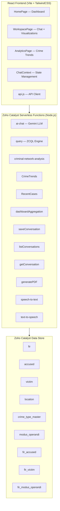
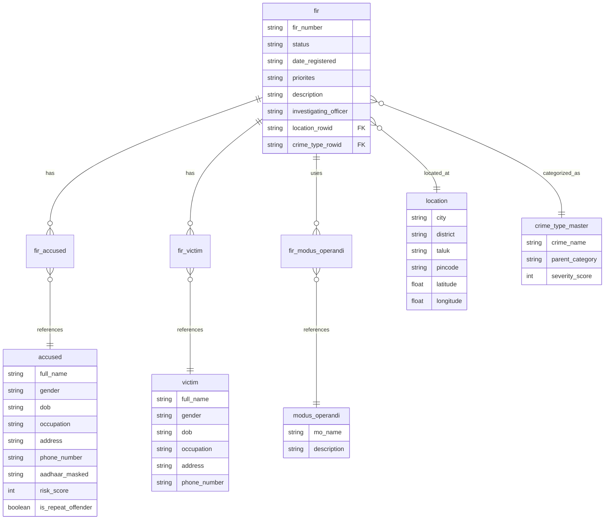

# KSP Catalyst — Lumina Intelligence: Project Analysis

## Overview

**Lumina Intelligence** is an AI-powered crime intelligence platform built for the **Karnataka State Police (KSP)**. It enables law enforcement officers to query, analyze, and visualize crime data using natural language — including Kannada. The system is deployed on **Zoho Catalyst** serverless infrastructure under the project name **Techsonic-Crime-Intelligence**.

---

## Architecture



---

## Tech Stack

| Layer | Technology |
|-------|-----------|
| **Frontend** | React 19, Vite 5, TailwindCSS 3, Framer Motion 12, Recharts 3, Lucide React |
| **Backend** | Zoho Catalyst serverless functions (Node.js) |
| **Database** | Zoho Catalyst Data Store (queried via ZCQL) |
| **AI / LLM** | Google Gemini 2.5 Flash (primary), Zoho Catalyst LLM / Qwen 14B (intent classification) |
| **PDF** | PDFKit |
| **i18n** | Custom (English + Kannada) |
| **Voice** | Speech-to-text and text-to-speech serverless functions |

---

## Project Structure

### Root-Level Files

| File | Purpose |
|------|---------|
| [catalyst.json](file:///d:/Project/KSP/KSP_catalyst/catalyst.json) | Zoho Catalyst project config — lists all 19 serverless functions + the `react-vite` slate |
| [.catalystrc](file:///d:/Project/KSP/KSP_catalyst/.catalystrc) | Catalyst CLI config — project ID `47024000000013051`, Development + Production environments |
| [package.json](file:///d:/Project/KSP/KSP_catalyst/package.json) | Root package — `catalyst serve` scripts, `zcatalyst-sdk-node` dependency |
| [test-model.js](file:///d:/Project/KSP/KSP_catalyst/test-model.js) | Standalone script to test Catalyst LLM API connectivity (Qwen GLM model) |

---

## Backend — 19 Serverless Functions

### Core Functions

| Function | File | Purpose |
|----------|------|---------|
| **ai-chat** | [index.js](file:///d:/Project/KSP/KSP_catalyst/functions/ai-chat/index.js) | **Main AI pipeline** (~2000 lines). Integrates Google Gemini 2.5 Flash for natural-language query understanding. Handles intent classification, entity extraction, context window management, token counting (English + Kannada), message prioritization, and response generation. Loads LLM and translation tokens from `.env`. |
| **query** | [index.js](file:///d:/Project/KSP/KSP_catalyst/functions/query/index.js) | **Core data query engine** (~1400 lines). Executes ZCQL queries against the Catalyst Data Store based on classified intents. Supports 20+ intents (see below). |
| **criminal-network-analysis** | [index.js](file:///d:/Project/KSP/KSP_catalyst/functions/criminal-network-analysis/index.js) | **Graph analytics engine** (~1028 lines). Builds criminal network graphs from database, computes graph metrics (degree/betweenness centrality, communities, shortest paths), and classifies actor roles. |

### Supporting Functions

| Function | Purpose |
|----------|---------|
| **chat-intent** | Regex-based intent classification fallback |
| **test-llm** | Intent classification via Catalyst LLM (Qwen 14B) |
| **ai-response** | Supplemental AI response handler |
| **dashboardAggregation** | Dashboard metrics aggregation |
| **CrimeTrends** | Crime trend analytics (year/month breakdowns) |
| **RecentCases** | Recent FIR cases feed |
| **saveConversation** | Persist chat conversations |
| **listConversations** | List conversation history |
| **getConversation** | Fetch full conversation by ID |
| **renameConversation** | Rename a saved conversation |
| **deleteConversation** | Delete a conversation |
| **generatePDF** | PDF report generation (PDFKit) |
| **logEvidence** | Log AI evidence artifacts |
| **getCurrentUser** | Get authenticated user info |
| **speech-to-text** | Audio transcription (voice input) |
| **text-to-speech** | TTS synthesis (audio response) |

---

## Database Schema (Zoho Catalyst Data Store)



---

## Supported Query Intents (via `query` function)

| Category | Intents |
|----------|---------|
| **Search** | `search_fir`, `search_accused`, `search_victim`, `search_investigation` |
| **FIR Details** | `fir_accused`, `fir_victims`, `fir_investigation` |
| **Accused Analysis** | `criminal_history`, `criminal_network`, `criminal_network_graph`, `repeat_offenders`, `risk_profile` |
| **Geo/Trend Analysis** | `crime_hotspots`, `crime_type_trends`, `monthly_crime_trends`, `district_crime_analysis`, `emerging_crime_clusters` |
| **Demographics** | `gender_crime_analysis`, `demographic_dashboard`, `repeat_offender_demographics`, `social_risk_analysis` |

---

## Criminal Network Analysis — Deep Dive

The [criminal-network-analysis](file:///d:/Project/KSP/KSP_catalyst/functions/criminal-network-analysis/index.js) function is a sophisticated graph analytics engine:

### Actions (API Endpoints)
| Action | Description |
|--------|-------------|
| `get_full_network` | Builds a full graph from all accused, victims, FIRs, locations, and MOs. Supports search/focus by name, FIR number, or location with BFS depth limiting. |
| `get_summary` | Lightweight dashboard data — top actors, crime distribution |
| `get_network_metrics` | Full graph + centrality metrics + communities |
| `find_shortest_path` | BFS shortest path between two persons with narrative |
| `identify_key_actors` | Ranks accused by composite score |
| `detect_communities` | Label propagation community detection with per-community stats |

### Graph Node Types
- **Accused** — risk score, repeat offender flag
- **Victim** — basic profile
- **FIR** — crime details, status, location, severity
- **Location** — deduplicated by city
- **Modus Operandi** — linked to FIRs

### Edge Types
- `ACCUSED_OF` — accused → FIR (with role)
- `VICTIM_OF` — victim → FIR
- `LOCATED_AT` — FIR → location
- `USES_MO` — FIR → modus operandi
- `CO_ACCUSED` — derived: accused who share FIRs
- `SHARED_LOCATION` — derived: accused active in same city

### Graph Algorithms
- **BFS reachable** — depth-limited subgraph extraction (skips weak edges)
- **Label Propagation** — community detection (max 50 iterations)
- **Brandes' algorithm** — betweenness centrality (normalized)
- **Degree centrality** — connection count / (n-1)
- **Composite scoring** — `0.3×betweenness + 0.3×degree + 0.25×risk + 0.15×repeat_offender`
- **Role classification** — LEADER / BROKER / HUB / HABITUAL / MEMBER

---

## Frontend Architecture

### Routing ([App.jsx](file:///d:/Project/KSP/KSP_catalyst/react-vite/src/App.jsx))

| Route | Page | Description |
|-------|------|-------------|
| `/` | `HomePage` | Dashboard with AI search bar, recent cases, hotspots, crime trends, alerts, network viz |
| `/chat/:id` | `WorkspacePage` | Split view — chat (left) + dynamic workspace visualizations (right) |
| `/analytics` | `AnalyticsPage` | Dedicated crime trends analytics page |
| `/reports` | Placeholder | Coming soon |
| `/settings` | Placeholder | Coming soon |

### Context Providers
| Provider | File | Purpose |
|----------|------|---------|
| `ThemeProvider` | [ThemeContext.jsx](file:///d:/Project/KSP/KSP_catalyst/react-vite/src/contexts/ThemeContext.jsx) | Dark/light theme |
| `LanguageProvider` | [LanguageContext.jsx](file:///d:/Project/KSP/KSP_catalyst/react-vite/src/contexts/LanguageContext.jsx) | English / Kannada i18n |
| `SidebarProvider` | [SidebarContext.jsx](file:///d:/Project/KSP/KSP_catalyst/react-vite/src/contexts/SidebarContext.jsx) | Sidebar collapse state |
| `ChatProvider` | [ChatContext.jsx](file:///d:/Project/KSP/KSP_catalyst/react-vite/src/context/ChatContext.jsx) | Core chat state — conversations, messages, loading, streaming, workspace, API integration (~730 lines) |

### Workspace Visualization Registry ([registry.js](file:///d:/Project/KSP/KSP_catalyst/react-vite/src/components/workspace/registry.js))

The AI response includes a `workspaceType` that dynamically selects a visualization component:

| Type | Component | Description |
|------|-----------|-------------|
| `heatmap` | `HeatMap` | Geographic crime distribution |
| `network` | `CriminalNetwork` → `NetworkGraph` | Interactive force-directed graph (Canvas 2D) |
| `network_metrics` | `NetworkMetrics` | Centrality metrics display |
| `network_path` | `ShortestPath` | Connection path visualization |
| `network_community` | `CommunityView` | Community structure display |
| `timeline` | `Timeline` | Event timeline |
| `chart` | `AnalyticsChart` | General analytics charts (Recharts) |
| `profile` | `OffenderProfile` | Criminal profile card |
| `financial` | `FinancialAnalysis` | Financial analysis view |
| `trend` | `CrimeTrend` | Crime trend line charts |
| `alert` | `RecentAlerts` | Alert feed |

### NetworkGraph Component ([NetworkGraph.jsx](file:///d:/Project/KSP/KSP_catalyst/react-vite/src/components/workspace/visualizations/NetworkGraph.jsx))
A custom Canvas 2D force-directed graph renderer (~668 lines):
- Force simulation with charge, link, and center forces
- Pan, zoom, drag interaction
- Node filtering by type + search
- Color coding by node type and community
- Click-to-select with neighbor highlighting
- Tooltip on hover

### Custom Hooks
| Hook | Purpose |
|------|---------|
| `useChat` | Shorthand for ChatContext |
| `useCriminalNetwork` | Criminal network data fetching & state |
| `useCrimeTrends` | Crime trends data fetching |
| `useRecentCases` | Recent cases data fetching |
| `useSpeechRecognition` | Browser speech recognition wrapper |
| `useAutoScroll` | Auto-scroll chat to bottom |
| `useDebounce` | Debounce input values |
| `useMediaQuery` | Responsive breakpoints |

### API Layer ([api.js](file:///d:/Project/KSP/KSP_catalyst/react-vite/src/services/api.js))
- `request()` / `requestGet()` / `requestBlob()` — fetch wrappers with timeout (5 min default), abort signal support
- `USE_MOCK` toggle for offline development with comprehensive mock data
- `normalizeAIResponse()` — standardizes varied backend response shapes
- Methods: `aiChat`, `dashboard`, `saveConversation`, `listConversations`, `getConversation`, `generatePDF`, `getCrimeTrends`, `getRecentCases`, `getCNASummary`, `searchCNANetwork`, `getCNAFullNetwork`, `transcribeAudio`, `synthesizeSpeech`

---

## Key Design Patterns

1. **Intent-Driven Architecture** — User queries → AI/regex intent classification → intent-specific ZCQL queries → structured response + workspace visualization
2. **Dynamic Visualization Dispatch** — Backend returns `workspaceType`; frontend registry maps it to the correct React component
3. **Multi-language** — English + Kannada (i18n JSONs), with LLM token counting that accounts for Kannada unicode
4. **Voice I/O** — Speech-to-text input + text-to-speech response via dedicated serverless functions
5. **Graph Analytics on Backend** — Full social network analysis (centrality, communities, shortest paths) computed server-side, Canvas 2D rendering client-side
6. **Conversation Persistence** — Conversations saved/loaded from Catalyst Data Store with optimistic UI updates
7. **Mock Mode** — Toggle `USE_MOCK = true` to run frontend entirely offline with realistic mock data

---

## Development & Deployment

```
# Frontend dev server → localhost:3001
cd react-vite && npm run dev

# Backend (Catalyst CLI) → localhost:3000
catalyst serve

# Deploy
catalyst deploy
```

- **Environment**: Development (`60073436832`) and Production (`50043092771`)
- **API URL**: Set via `VITE_API_URL` in `react-vite/.env.local`
- **LLM Tokens**: Set via `.env` in the `ai-chat` function directory (`LLM_ACCESS_TOKEN`, `TRANSLATE_ACCESS_TOKEN`)
