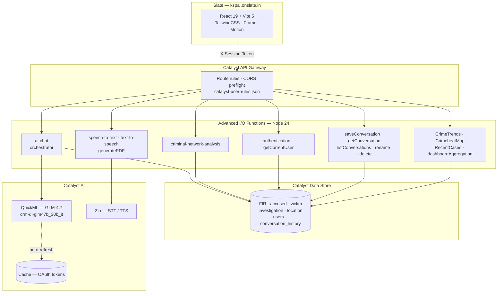

# KSP Lumina

**AI-powered conversational crime intelligence for the Karnataka State Police.**

KSP Lumina lets investigating officers interrogate crime data in plain English or Kannada — no SQL, no dashboards to configure. Ask *"show me repeat offenders in Mysuru linked to the Jayanagar chain-snatching case"* and get a written analysis alongside a live network graph, heat map, or trend chart rendered next to the conversation.

Built entirely on Zoho Catalyst: 21 serverless functions, a Data Store crime schema queried via ZCQL, and a GLM-4.7 LLM hosted on Catalyst QuickML.

---

## Table of Contents

- [Features](#features)
- [Architecture](#architecture)
- [Tech Stack](#tech-stack)
- [Project Structure](#project-structure)
- [Data Model](#data-model)
- [API Reference](#api-reference)
- [Environment Variables](#environment-variables)
- [Local Development](#local-development)
- [Deployment](#deployment)
- [API Gateway & CORS Configuration](#api-gateway--cors-configuration)
- [Security](#security)
- [Troubleshooting](#troubleshooting)
- [Known Limitations](#known-limitations)

---

## Features

### Conversational crime analysis

Natural-language questions are resolved through a multi-stage pipeline rather than a single prompt. The `ai-chat` function detects the input language, normalizes the question, classifies intent, generates and executes ZCQL against the crime schema, formats the result set for the model, and returns a narrative answer with a structured visualization payload attached.

- **Bilingual end to end** — Kannada input is translated to English for querying, and the final answer is translated back to Kannada with Markdown structure (headings, bold, bullets, line breaks) preserved verbatim. Translation retries up to 3 times and validates that the output actually differs from the input before accepting it.
- **Context-window management** — a token counter weighted for Kannada's Unicode range (`ಀ–೿`) measures conversation cost, messages are scored by role and recency, and a sliding window keeps the most valuable context within budget instead of naively truncating.
- **Context-aware follow-ups** — `resolveContextAwareIntent` reads prior turns so *"and his associates?"* resolves against the previously discussed individual.
- **Cross-table entity search** — `searchAllTables` resolves a person's name across FIR, accused, victim, and investigation records when the question doesn't specify where to look.
- **Self-healing history** — `fixCorruptedConversation` repairs malformed stored conversations rather than failing the request.

### Criminal network analysis

A dedicated graph engine (`criminal-network-analysis`) builds a co-offending network from FIR linkages and runs real graph algorithms server-side:

| Action | What it computes |
|---|---|
| `get_full_network` | Complete node/edge graph with community assignment |
| `get_summary` | High-level network statistics |
| `get_network_metrics` | Degree + Brandes betweenness centrality, composite scoring |
| `find_shortest_path` | BFS path between two individuals, with a generated narrative |
| `identify_key_actors` | Role classification (hub, broker, peripheral) from centrality |
| `detect_communities` | Label-propagation community detection |

### Interactive workspace

Every answer can carry a visualization, rendered through a component registry (`workspace/registry.js`) keyed by type — the LLM chooses the view, the frontend renders it:

`heatmap` · `network` · `network_metrics` · `network_path` · `network_community` · `timeline` · `chart` · `profile` · `financial` · `trend` · `alert`

Graphs are drawn with `react-force-graph-2d`, maps with Leaflet + `leaflet.heat`, and charts with Recharts.

### Dashboard & analytics

- **Crime trends** — time series over `date_registered` joined to `crime_type_master`, filterable by year and month
- **Crime heat map** — geospatial density across Karnataka districts
- **Recent cases** — latest FIR activity feed
- **Operational summary** — aggregated metrics via `dashboardAggregation`
- **Live hotspots** and **suggested threads** on the landing page

### Voice

- **Speech input** — browser Web Speech API (`useSpeechRecognition`, `en-IN`) with a server-side Zia transcription endpoint as an alternative path
- **Speech output** — `/text-to-speech` returns an audio blob via Catalyst Zia

### Reporting & audit

- **PDF export** — PDFKit generates `conversation` and `crime_trends` reports, with bundled Noto Sans Kannada fonts so Kannada renders correctly in output
- **Evidence log** — `logEvidence` writes every AI-cited record into `ai_evidence_log` with source table, source row, and confidence score, creating an audit trail from an AI claim back to the underlying FIR

### Conversations

Full CRUD — create, list, load, rename, delete — persisted to `conversation_history`, with optimistic UI, streaming responses, and abortable in-flight requests.

### Platform

- **Authentication** — email + password with bcrypt hashing, opaque session tokens, forced initial-password set, and forgot-password flow
- **Role-aware UI** — roles resolved server-side and surfaced in the header
- **Dark / light theme** with system preference detection
- **Responsive layout** with collapsible sidebar
- **Error boundaries** around visualization rendering so a bad payload never blanks the app

---

## Architecture



### Request pipeline for a chat message

```
User question (en | kn)
  → language detection
  → translate kn → en                     [GLM-4.7]
  → query normalization
  → intent classification                 [GLM-4.7]
  → ZCQL execution against Data Store
  → result summarization + formatting
  → answer generation with sliding-window context   [GLM-4.7]
  → translate en → kn (Markdown preserved)
  → { text, workspaceType, workspaceData } → client
```

### Token management

Catalyst QuickML access tokens expire hourly. `shared/tokenManager.js` handles this without human intervention:

1. Read the token from **Catalyst Cache** (segment `zoho_tokens`) — shared across all function instances
2. On miss or expiry, exchange `ZOHO_REFRESH_TOKEN` at `accounts.zoho.in/oauth/v2/token`
3. Write the new token back with a **55-minute TTL**
4. `withAutoRefresh()` detects a `401` mid-flight and retries once with a fresh token

An in-process memory fallback covers `catalyst serve` local runs, and a static `LLM_ACCESS_TOKEN` from `.env` is the last resort for offline development.

---

## Tech Stack

| Layer | Technology |
|---|---|
| **Frontend** | React 19.2, Vite 5.3, TailwindCSS 3.4, Framer Motion 12 |
| **Routing** | React Router 7.18 |
| **Icons** | Lucide React |
| **Charts** | Recharts 3.9 |
| **Maps** | Leaflet 1.9, React-Leaflet 5, leaflet.heat |
| **Graphs** | react-force-graph-2d 1.29, graphify |
| **Backend** | Zoho Catalyst Advanced I/O Functions, Node.js 24 |
| **Database** | Catalyst Data Store (ZCQL) |
| **LLM** | GLM-4.7 (`crm-di-glm47b_30b_it`) on Catalyst QuickML |
| **Speech** | Catalyst Zia (STT/TTS) + browser Web Speech API |
| **Cache** | Catalyst Cache (OAuth token store) |
| **Auth** | bcryptjs, opaque session tokens |
| **PDF** | PDFKit 0.15 + Noto Sans Kannada |
| **Hosting** | Catalyst Slate (frontend), Catalyst Serverless (backend) |
| **Build** | @vitejs/plugin-react-swc, PostCSS, Autoprefixer |
| **Lint** | ESLint 8 with React + Hooks plugins |

---

## Project Structure

```
KSP_catalyst/
├── catalyst.json                 # Project manifest — functions, slate, apig
├── catalyst-user-rules.json      # API Gateway route rules
│
├── functions/                    # 21 Advanced I/O functions (Node 24)
│   ├── ai-chat/                  # ★ Main orchestrator (1,900 LOC)
│   │   ├── index.js              #   Pipeline: detect → translate → intent → query → answer
│   │   ├── resolveUser.js        #   Session → user row resolution
│   │   ├── session.js            #   Session token validation
│   │   └── shared/
│   │       ├── tokenManager.js   #   OAuth auto-refresh + Cache
│   │       ├── quickmlAuth.js    #   QuickML authentication
│   │       └── quickmlClient.js  #   QuickML HTTP client
│   ├── query/                    # Standalone ZCQL query engine (1,400 LOC)
│   ├── criminal-network-analysis/# Graph algorithms (1,000 LOC)
│   ├── authentication/           # login · logout · forgot-password · set-initial-password
│   ├── getCurrentUser/           # Session validation + public user projection
│   ├── chat-intent/              # Intent classification
│   ├── ai-response/              # Response generation helpers
│   ├── saveConversation/         # Persist conversation
│   ├── getConversation/          # Load one conversation
│   ├── listConversations/        # List user conversations
│   ├── renameConversation/       # Rename
│   ├── deleteConversation/       # Delete
│   ├── CrimeTrends/              # Time-series aggregation
│   ├── CrimeheatMap/             # Geospatial density
│   ├── RecentCases/              # Latest FIR feed
│   ├── dashboardAggregation/     # Dashboard metrics
│   ├── logEvidence/              # Audit trail writer
│   ├── generatePDF/              # PDFKit reports
│   │   ├── reportFactory.js      #   Report type dispatch
│   │   ├── reports/              #   conversationReport · crimeTrendReport
│   │   └── fonts/                #   NotoSansKannada Regular + Bold
│   ├── speech-to-text/           # Zia STT
│   ├── text-to-speech/           # Zia TTS
│   └── syncCrimeMLFeatures/      # ML feature sync job
│
└── react-vite/                   # Frontend (Catalyst Slate app)
    ├── vite.config.js            # Dev proxy for all gateway endpoints
    ├── tailwind.config.js
    └── src/
        ├── App.jsx               # Router + provider composition
        ├── pages/                # HomePage · WorkspacePage · AnalyticsPage
        ├── contexts/             # Auth · Language · Theme · Sidebar
        ├── context/              # ChatContext (conversation state machine)
        ├── components/
        │   ├── auth/             # Login · ForgotPassword · SetInitialPassword
        │   ├── chat/             # ChatWindow · ChatInput · ChatMessage · MarkdownRenderer
        │   ├── workspace/        # DynamicWorkspace · WorkspaceRenderer · registry
        │   │   └── visualizations/  # 13 visualization components
        │   ├── dashboard/        # CrimeTrends · RecentCases · CrimeDistribution
        │   ├── landing/          # KarnatakaCrimeMap · LiveHotspots · CriminalNetworkViz
        │   ├── layout/           # MainLayout · Header · NotificationDropdown
        │   ├── sidebar/          # Collapsible navigation
        │   └── common/           # Button · Modal · Toast · ErrorBoundary · VoiceButton
        ├── hooks/                # useCrimeTrends · useCriminalNetwork · useSpeechRecognition …
        ├── services/             # api.js · catalystAuth.js · mockData.js
        ├── i18n/                 # en.json (210 keys) · kn.json (202 keys)
        └── utils/                # constants · formatters · helpers
```

---

## Data Model

Catalyst Data Store tables queried through ZCQL:

| Table | Purpose |
|---|---|
| `fir` | First Information Reports — the spine of the schema |
| `accused` | Accused individuals |
| `victim` | Victims |
| `investigation` | Investigation status, officer, dates |
| `location` | Geographic records for mapping |
| `modus_operandi` | MO classifications |
| `crime_type_master` | Crime type lookup (`crime_name`) |
| `fir_accused` | FIR ↔ accused join |
| `fir_victim` | FIR ↔ victim join |
| `fir_modus_operandi` | FIR ↔ MO join |
| `users` | Officer accounts, `password_hash`, role reference |
| `user_sessions` | Active sessions, 12-hour TTL |
| `conversation_history` | Persisted chat threads |
| `ai_evidence_log` | Audit trail: `conversation_rowid`, `source_table`, `source_rowid`, `confidence_score` |

Relationships are traversed with ZCQL joins, e.g.:

```sql
SELECT f.date_registered, f.crime_type_rowid, c.crime_name
FROM fir AS f
LEFT JOIN crime_type_master AS c ON f.crime_type_rowid = c.ROWID
ORDER BY f.date_registered ASC
```

---

## API Reference

All routes sit behind the Catalyst API Gateway. Authenticated routes require the `X-Session-Token` header.

> **Note:** paths must be sent **without a trailing slash** — the gateway matches `source_endpoint` exactly, and `/ai-chat/` will not match a rule for `/ai-chat`.

| Endpoint | Method | Auth | Description |
|---|---|---|---|
| `/authentication` | POST | — | `login` · `logout` · `forgot-password` · `set-initial-password` |
| `/getCurrentUser` | GET | ✓ | Validate session, return public user + role |
| `/ai-chat` | POST | ✓ | Main conversational endpoint |
| `/criminal-network-analysis` | POST | ✓ | Graph analysis (see action table above) |
| `/dashboardAggregation` | GET | ✓ | Dashboard metrics |
| `/CrimeTrends` | GET | ✓ | Time series — `?year=&month=` |
| `/CrimeheatMap` | GET | ✓ | Geospatial density |
| `/RecentCases` | GET | ✓ | Latest FIR feed |
| `/saveConversation` | POST | ✓ | Persist a conversation |
| `/getConversation` | POST | ✓ | Load by `conversationId` |
| `/listConversations` | GET | ✓ | List user conversations |
| `/renameConversation` | POST | ✓ | Set `conversation_title` |
| `/deleteConversation` | POST | ✓ | Delete by `conversationId` |
| `/logEvidence` | POST | ✓ | Append to audit log |
| `/generatePDF` | POST | ✓ | `conversation` or `crime_trends` report |
| `/speech-to-text` | POST | ✓ | Raw audio buffer → transcript |
| `/text-to-speech` | POST | ✓ | Text → audio blob |

**Auth flow:**

```
POST /authentication { action: "login", email, password }
  → { success: true, token, user }
  → client stores token under localStorage key `ksp_lumina_session_token`
  → every subsequent request sends header  X-Session-Token: <token>
```

The header is deliberately **not** `Authorization` — the Catalyst API Gateway intercepts `Authorization` and attempts its own CatalystUserManagement validation, rejecting the app's custom token before it reaches function code.

---

## Environment Variables

### Frontend — `react-vite/.env.local` (development)

```bash
# Leave empty in development so requests go through the Vite dev proxy
VITE_API_URL=

# Request timeout in ms (LLM calls are slow — keep this generous)
VITE_API_TIMEOUT=300000

# Dev proxy target — where `catalyst serve` is listening
VITE_BACKEND_URL=http://localhost:3000

# Catalyst project identifiers
VITE_CATALYST_APP_ID=47024000000013051
VITE_CATALYST_DOMAIN=your-project-60073436832.development
```

### Frontend — `react-vite/.env.production`

```bash
# Absolute gateway origin — Slate serves from a different domain than the functions
VITE_API_URL=https://your-project-60073436832.development.catalystserverless.in
VITE_API_TIMEOUT=300000
VITE_CATALYST_APP_ID=47024000000013051
VITE_CATALYST_DOMAIN=your-project-60073436832.development
```

> Only `VITE_`-prefixed variables are exposed to the bundle, and they are **inlined at build time** — never put a secret in one. Values set in the Slate console are picked up by `import.meta.env` during the build; no `define` block or `process.env` shim is required.

### Backend — `functions/ai-chat/.env` (local development only)

```bash
# ── Zoho OAuth auto-refresh (recommended) ────────────────────
# Set these in the Catalyst Console for deployed functions.
# With these present, access tokens refresh automatically forever.
ZOHO_CLIENT_ID=1000.XXXXXXXXXXXXXXXXXXXXXXXXXXXX
ZOHO_CLIENT_SECRET=your_client_secret_here
ZOHO_REFRESH_TOKEN=1000.xxxxxxxxxxxxxxxxxxxxxxxxxxxxxxxx

# ── Optional overrides ───────────────────────────────────────
CATALYST_ORG_ID=your_org_id_here
CATALYST_PROJECT_ID=your_project_id_here

# ── Static token fallback (offline dev only) ─────────────────
# Expires hourly and needs manual regeneration.
# Used only when ZOHO_REFRESH_TOKEN is absent.
LLM_ACCESS_TOKEN=''
TRANSLATE_ACCESS_TOKEN=''
```

### Where each variable belongs in production

| Variable | Slate config | Function config |
|---|:---:|:---:|
| `VITE_API_URL` | ✓ | — |
| `VITE_API_TIMEOUT` | ✓ | — |
| `VITE_CATALYST_APP_ID` | ✓ | — |
| `VITE_CATALYST_DOMAIN` | ✓ | — |
| `ZOHO_CLIENT_ID` | — | ✓ |
| `ZOHO_CLIENT_SECRET` | — | ✓ |
| `ZOHO_REFRESH_TOKEN` | — | ✓ |
| `LLM_ACCESS_TOKEN` | — | ✓ |
| `TRANSLATE_ACCESS_TOKEN` | — | ✓ |

**Do not put Zoho secrets in the Slate configuration.** Slate is frontend build config; the React app never reads them, so their presence there is exposure with no upside — one careless `VITE_` rename away from shipping credentials to every browser.

Console paths:
- **Slate** → *Slate → your app → Configuration → Environment Variables*
- **Functions** → *Serverless → Functions → `<function>` → Configuration → Environment Variables*

---

## Local Development

### Prerequisites

- Node.js 24+
- Zoho Catalyst CLI — `npm install -g zcatalyst-cli`
- A Catalyst project with Data Store, Cache, QuickML, and Zia enabled

### Setup

```bash
git clone <repository-url>
cd KSP_catalyst

# Root tooling
npm install

# Frontend
cd react-vite && npm install && cd ..

# Authenticate and link to your Catalyst project
catalyst login
catalyst link
```

Create `react-vite/.env.local` and `functions/ai-chat/.env` from the samples above.

### Run

Both tiers together, from the repository root:

```bash
npm run dev
```

This runs `catalyst serve --no-open` (backend, port **3000**) and the Vite dev server (frontend, port **3001**) concurrently with colour-coded output.

Individually:

```bash
npm run serve              # backend only  → localhost:3000
npm run dev:frontend       # frontend only → localhost:3001
```

In development, `vite.config.js` proxies all 18 gateway endpoints to the local backend, so `VITE_API_URL` stays empty and every request is same-origin — no CORS involved.

### Frontend scripts

```bash
cd react-vite
npm run dev        # Dev server with HMR
npm run build      # Production build → dist/
npm run preview    # Preview the production build locally
npm run lint       # ESLint, zero-warning policy
```

### Mock mode

Set `USE_MOCK = true` at the top of [`react-vite/src/services/api.js`](react-vite/src/services/api.js) to run the entire frontend against fixture data in `mockData.js` — useful for UI work with no backend or Catalyst credentials.

---

## Deployment

### Full deploy

```bash
catalyst deploy
```

Deploys everything declared in `catalyst.json`: all 21 functions, the Slate frontend, and the API Gateway rules from `catalyst-user-rules.json`.

### Targeted deploys

```bash
catalyst deploy --only slate                    # Frontend only
catalyst deploy --only functions                # All functions
catalyst deploy --only functions:ai-chat        # A single function
catalyst deploy --except client                 # Everything but the client
```

### Deployment topology

| Component | Host |
|---|---|
| Frontend (Slate) | `kspai.onslate.in` |
| Functions + Gateway | `<project>.development.catalystserverless.in` |

These are **different origins**, so every frontend → backend call is cross-origin and depends on the gateway CORS configuration below.

### Checklist

1. Set all `VITE_` variables in the Slate console
2. Set Zoho OAuth variables on each function that calls the LLM
3. Whitelist the Slate domain (below)
4. `catalyst deploy`
5. Verify a preflight succeeds (see [Troubleshooting](#troubleshooting))

---

## API Gateway & CORS Configuration

Because Slate and the functions live on different domains, three things must line up. Each has a failure mode that presents as a generic browser CORS error, so they're worth knowing individually.

### 1. Domain whitelist

*Catalyst Console → Cloud Scale → Authentication → Whitelisting → Authorized Domains*

Add `kspai.onslate.in` (and `localhost:3001` for local cross-origin testing) with **CORS enabled**.

The gateway answers `OPTIONS` preflights **itself** — the request never reaches function code. No amount of `Access-Control-*` header setting inside a function will fix a preflight failure; the whitelist is the only lever. This is why none of the functions in this repository set CORS headers.

### 2. Route methods

Routes are declared in `catalyst-user-rules.json`. A route only answers a preflight whose `Access-Control-Request-Method` it permits, so browser-facing routes should be declared `"method": "ANY"`:

```json
{
  "name": "ai-chat",
  "source_endpoint": "/ai-chat",
  "target_endpoint": "/server/ai-chat/",
  "target": "advancedio",
  "method": "ANY"
}
```

### 3. Exact path matching

`source_endpoint` is matched **exactly**. A request to `/ai-chat/` does not match a rule for `/ai-chat` — the preflight returns `404` with no CORS headers, and the browser reports only "CORS error" without ever naming the path mismatch. Keep frontend paths in [`api.js`](react-vite/src/services/api.js) free of trailing slashes.

---

## Security

- **Passwords** — bcrypt with cost factor 10; hashes never leave the function tier
- **Sessions** — opaque random tokens, stored hashed in `user_sessions`, 12-hour TTL, revocable per user
- **Custom auth header** — `X-Session-Token` rather than `Authorization`, to avoid gateway interception
- **No cookie auth** — nothing in the backend reads cookies; `credentials: 'include'` is unnecessary on requests
- **Secrets** — held only in function environment variables and never in the frontend bundle. Verify before shipping:
  ```bash
  grep -r "your_secret_value" react-vite/dist/    # must return nothing
  ```
- **Audit trail** — `ai_evidence_log` records the provenance of every AI-cited record, so any generated claim can be traced to its source FIR
- **Rotation** — if `ZOHO_CLIENT_SECRET` or `ZOHO_REFRESH_TOKEN` is ever exposed, rotate it in the Zoho API Console and update the function configuration; the refresh token is long-lived and grants continuous API access until revoked

All `.env` files are gitignored. Commit `.env.example` files only.

---

## Troubleshooting

### CORS error in the browser

Reproduce the preflight from a shell, copying the **exact** failing URL from the DevTools Network panel — including any trailing slash:

```bash
curl -i -X OPTIONS "https://<project>.catalystserverless.in/ai-chat" \
  -H "Origin: https://kspai.onslate.in" \
  -H "Access-Control-Request-Method: POST" \
  -H "Access-Control-Request-Headers: content-type,x-session-token"
```

| Result | Cause | Fix |
|---|---|---|
| `200` + `Access-Control-Allow-Origin` | Correct | Look elsewhere |
| `200`, no CORS headers | Origin not whitelisted | Add the domain in the console |
| `404` | Path mismatch or method not allowed | Check trailing slash; check the route's `method` |

Send the method the frontend actually uses for that route — probing a GET-only route with `Access-Control-Request-Method: POST` produces a misleading `404`.

### LLM calls fail with 401

The access token expired and refresh failed. Confirm `ZOHO_CLIENT_ID`, `ZOHO_CLIENT_SECRET`, and `ZOHO_REFRESH_TOKEN` are set on the function, then check the logs for `[tokenManager]`. A revoked refresh token must be regenerated in the Zoho API Console.

### Requests time out

LLM round-trips can take minutes on complex questions. `VITE_API_TIMEOUT` defaults to 300000 ms (5 min); raise it before assuming a hang.

### Kannada text renders as boxes in a PDF

The Noto Sans Kannada fonts in `functions/generatePDF/fonts/` were not bundled. Confirm they exist and redeploy that function.

---

## Known Limitations

- **Zia STT/TTS fall back to mock output.** When the Zia speech methods aren't available on the SDK context, `speech-to-text` returns a hardcoded string and `text-to-speech` returns mock audio rather than failing. This keeps local development unblocked but means a misconfigured deployment fails silently — check the function logs for `using fallback mock` before trusting voice output in production.
- **Analytics and Reports pages are placeholders.** The routes exist and render a "coming soon" state; the underlying data endpoints are live and used by the dashboard.
- **The deployed gateway rules currently lag `catalyst-user-rules.json`.** Ten routes are declared `ANY` locally while the deployed gateway still holds their original `GET`/`POST` values. This is harmless in practice, but a `catalyst deploy` will reconcile them.
- **Browser speech recognition is Chromium-only.** `useSpeechRecognition` depends on the Web Speech API; Firefox has no support and will hide the voice input affordance.

---

## License

Proprietary — Karnataka State Police. Not for public distribution.
